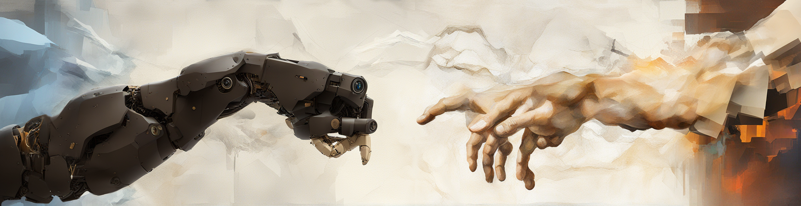

## Image generation model link:

https://drive.google.com/file/d/1AgXs7wMjD3SVlWuRuRHuXHrGYwN9FYCk/view?usp=sharing

## Additional notes

### !!!This project is not actively maintained. It is for archival purposes only and mustn't be hosted on any public server!!!

- place a huggingface_token.txt in the ai/-folder and add a Huggingface access token to download the Llama-2 model (might need to apply for access)

- all of the images used to train the custom image model and their descriptions are in the `model training images` folder. The model was trained using the following settings:

  | Name                    | Value         |
  | ----------------------- | ------------- |
  | Epochs                  | 8             |
  | Learning Rate           | 1e-05         |
  | Learning Rate Scheduler | cosine        |
  | Learning Rate Warmup %  | 10            |
  | Batch Size              | 2             |
  | Buckets                 | Yes           |
  | Optimizer               | AdamW8bit     |
  | Base Model              | SDXL-Base-1.0 |
  | Precision               | bf16          |

- AI requirements can be installed with `pip install -r .\requirements.txt --extra-index-url https://download.pytorch.org/whl/cu118`

- Frontend requirements can be installed as usual using `npm` or `yarn`
